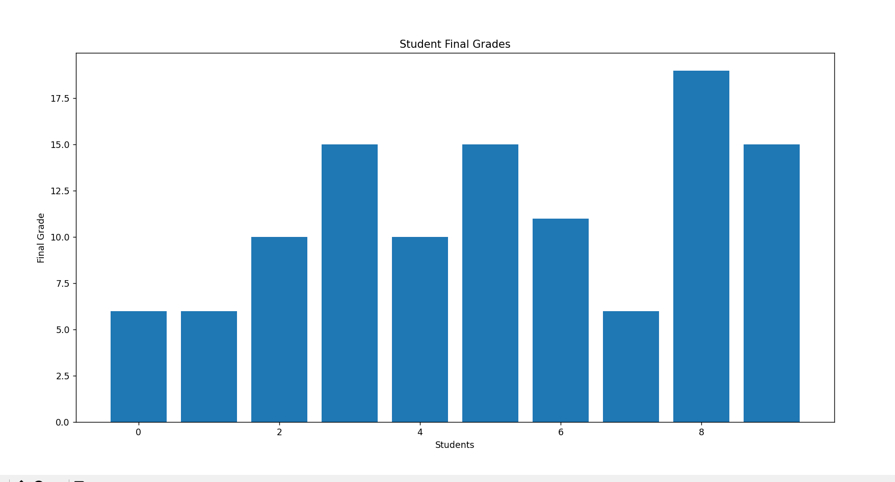
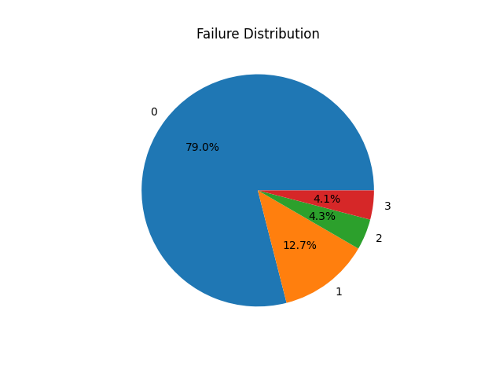

# Data Cleaning & Reporting Automation

## Objective
This project automates data cleaning and reporting workflows using Python.  
The system processes raw datasets, removes inconsistencies, generates reports, and creates visual summaries automatically.

---

## Tools & Technologies Used
- Python
- pandas
- matplotlib
- VS Code

---

## Dataset
The project uses a student dataset containing academic performance information.

Dataset Features:
- Study Time
- Number of Failures
- Absences
- Previous Grades
- Parent Education
- Lifestyle Information

---

## Project Workflow

1. Load dataset
2. Perform data cleaning
3. Remove missing values
4. Remove duplicate records
5. Generate statistical summary
6. Export cleaned dataset
7. Create automated report
8. Generate visual graphs

---

## Features
- Automated data cleaning
- Missing value handling
- Duplicate removal
- Automated report generation
- CSV export automation
- Bar chart visualization
- Pie chart visualization
- Data preprocessing using Python

---

## Data Cleaning Techniques Used

### Missing Value Handling
Rows with missing values were removed using pandas.

### Duplicate Removal
Duplicate records were automatically identified and removed.

### Automated Reporting
Dataset summaries were generated automatically and saved into a text report.

---

## Visualizations

The project generates:
- Bar Chart
- Pie Chart
- Dataset Summary Report

---

## Project Structure

```plaintext
DataCleaningAutomation/
│
├── main.py
├── data.csv
├── cleaned_data.csv
├── report.txt
├── README.md
├── bar_chart.png
├── pie_chart.png
│
└── screenshots/
    ├── terminal_output.png
```

---

## Installation

Install required libraries:

```bash
pip install pandas matplotlib
```

---

## Run the Project

```bash
python main.py
```

---

## Output Screenshots

### Terminal Output


---

### Bar Chart Visualization



---

### Pie Chart Visualization



---

## Generated Files

The project automatically generates:

- cleaned_data.csv
- report.txt
- bar_chart.png
- pie_chart.png

---

## Results
The project successfully automated the process of:
- cleaning raw data
- removing inconsistencies
- generating summaries
- creating reports
- visualizing data trends

This improves reporting efficiency and reduces manual effort.

---

## Conclusion
Successfully implemented a Data Cleaning & Reporting Automation system using Python and pandas.  
The project demonstrates practical data preprocessing, workflow automation, and reporting techniques commonly used in Data Analytics.

---